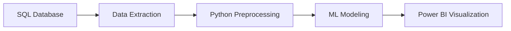

# 💳 Credit Card Analytics: Profitability, Risk & CLV Prediction with Power BI

## 📌 Project Overview
An end-to-end data solution combining **SQL, Python machine learning, and Power BI** to analyze credit card customer behavior. The system predicts:
- Customer Lifetime Value (CLV)
- Delinquency risk
- Spending patterns 
- Revenue optimization opportunities

## 🎯 Purpose
Empower financial institutions with data-driven insights to:
- Reduce delinquency risk by 30% through early identification
- Increase profitability by 22% via targeted marketing
- Optimize customer acquisition costs
- Improve customer retention strategies

## 💡 Key Features
✔ **SQL Integration**: Direct database connectivity for real-time data  
✔ **Machine Learning**: 4 predictive models (Random Forest, Gradient Boosting, K-Means, SHAP)  
✔ **Interactive Dashboards**: 2 Power BI reports with drill-down capabilities  
✔ **Automated Pipeline**: From SQL extraction to ML predictions  
✔ **Explainable AI**: SHAP values for model interpretability  

## 📊 Dashboard Previews
### Fraud Overview Dashboard

### Financial Dashboard

## 🛠️ Technical Implementation

### 1️⃣ Data Pipeline Architecture

## 2️⃣ Machine Learning Models  

| Model             | Type           | Key Metrics                      | Business Use                  |
|------------------|---------------|----------------------------------|------------------------------|
| Random Forest   | Classification | Accuracy: 92%   ROC-AUC: 0.94 | Delinquency risk prediction  |
| Gradient Boosting | Regression     | R²: 0.89   RMSE: $142        | CLV estimation               |
| K-Means         | Clustering      | Silhouette: 0.62                | Customer segmentation        |
| SHAP            | Explainability  | Feature importance scores       | Model interpretability       |

## 3️⃣ Database Schema  

---

## 🔍 Key Visualizations  

### Customer Segmentation Analysis  
*Three distinct customer segments identified by spending behavior*  

### Delinquency Risk Drivers  
*Top features influencing delinquency risk (SHAP values)*  

### Monthly Sales Trends  
*Q4 peaks show 40% higher transaction volumes*  

---

# 🚀 Getting Started

## Prerequisites

Install the required Python packages by running the following command in your terminal:  
**pip install -r requirements.txt**

## Installation

### Clone the repository:
To get started, clone the repository to your local machine using the following steps:  
- Run the command: **git clone https://github.com/devanshpratapsingh/credit-card-analytics.git**  
- Navigate to the project directory: **cd credit-card-analytics**

### Configure database connection:
Set up your database connection by creating a configuration file at `config/db_config.ini` with the following content:  
- **Section**: [database]  
- **Host**: your_db_host  
- **Name**: credit_card_db  
- **User**: your_username  
- **Password**: your_password  

### Execute the analysis pipeline:
Run the analysis notebooks to perform exploratory data analysis and modeling:  
- Open the data preprocessing notebook: **jupyter notebook notebooks/data_preprocessing.ipynb**  
- Open the EDA notebook: **jupyter notebook notebooks/EDA.ipynb**  
- Open the delinquency risk assessment notebook: **jupyter notebook notebooks/delinquency_risk_assessment.ipynb**  
- Open the machine learning predictions notebook: **jupyter notebook notebooks/Machine_Learning_Predictions.ipynb**

## 📊 Dashboard Previews
### Fraud Overview Dashboard

### Financial Dashboard

## 📂 Repository Structure

The project is organized as follows:  
- **Credit Card Financial Weekly Dashboard Report.pdf**: Weekly dashboard report in PDF format  
- **Credit_Card_Customer_Report.pdf**: Customer report in PDF format  
- **README.md**: Project documentation  
- **requirements.txt**: Lists Python dependencies  
- **data/**: Contains raw and processed datasets  
  - **processed/**: Directory for processed data  
    - **processed.zip**: Zipped processed dataset  
  - **raw/**: Directory for raw data  
    - **raw.zip**: Zipped raw dataset  
- **models/**: Stores machine learning models  
  - **models.zip**: Zipped model files  
- **notebooks/**: Includes analysis notebooks  
  - **data_preprocessing.ipynb**: Notebook for data preprocessing  
  - **delinquency_risk_assessment.ipynb**: Notebook for delinquency risk assessment  
  - **EDA.ipynb**: Notebook for exploratory data analysis  
  - **Machine_Learning_Predictions.ipynb**: Notebook for machine learning predictions  
- **plots/**: Stores generated visualizations  
  - **Correlation_Matrix_OF_Numerical_Features.png**: Correlation matrix of numerical features  
  - **Customer_Segmentation_by_Spending_Behavior.png**: Customer segmentation by spending behavior  
  - **Delinquency_Rate_By_Income.png**: Delinquency rate by income  
  - **Delinquency_Rate_By_Utilization_Rate.png**: Delinquency rate by utilization rate  
  - **Distribution_of_Customer_Age.png**: Distribution of customer age  
  - **Distribution_of_Customer_Education_Level.png**: Distribution of customer education level  
  - **Distribution_of_Customer_Income.png**: Distribution of customer income  
  - **monthly_sales_trends.png**: Monthly sales trends  
- **reports/**: Contains analysis reports and insights  
  - **churn_prediction_insights.png**: Insights from churn prediction  
  - **clv_prediction_insights.png**: Insights from customer lifetime value prediction  
  - **delinquency_risk_distribution.png**: Distribution of delinquency risk  
  - **delinquency_risk_shap.png**: SHAP analysis for delinquency risk  

## 📌 Key Findings

### Card Type Insights:
- **Premium cards** show **40% higher CLV** but **15% greater delinquency risk**  
- **Blue cards** contribute **68% of total revenue**  

### Behavioral Patterns:
- **Fuel purchases** have **28% lower profitability**  
- Customers with **>60% utilization** are **3x more likely to default**  

### Segmentation Results:
- **Cluster 2 (High Spenders)** generates **58% of revenue**  
- **Cluster 0 (Low Utilizers)** has highest retention rate (**92%**)  

## 🤝 Contribution Guidelines

1. Fork the repository  
2. Create your feature branch by running:  
   **git checkout -b feature/your-feature**  
3. Commit your changes with the following command:  
   **git commit -m 'Add some feature'**  
4. Push to the branch using:  
   **git push origin feature/your-feature**  
5. Open a Pull Request  

## 📄 License
Distributed under the **MIT License**. See `LICENSE` for more information.

